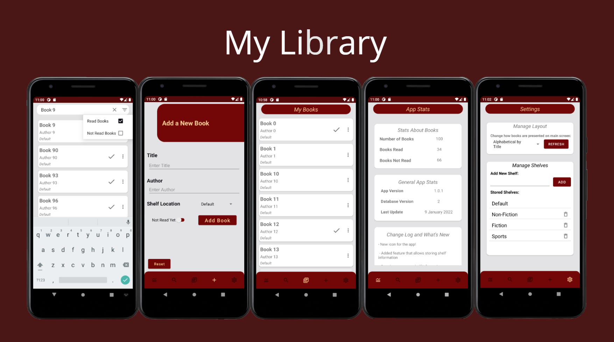

# My Library
A simple way to keep track of your books! Click [here](https://github.com/vp-98/My_Library) to view the React Native version.

## Features
- Store book information locally
- Save books by shelf location/name
- Search through all the saved books by title and/or by author easily
- Keep track of books that have been read and those that have not
- Simple stats page providing statistics of stored books

## Android Version and Testing
Minimum API required: Android 10 (Build code Q) 
Recommended: Android 11

This app has been tested on:
- Google Pixel 3A with Android 11 (API 30)
- Samsung Galaxy S20 5G with Android 11 (API 30)
